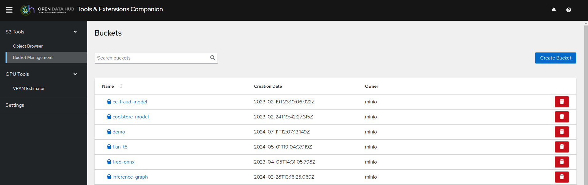
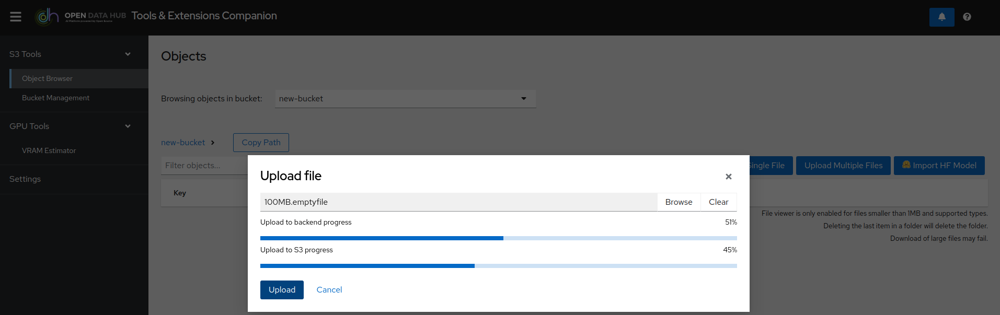
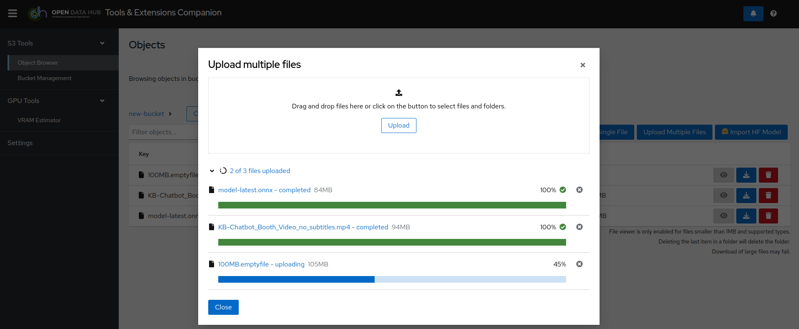
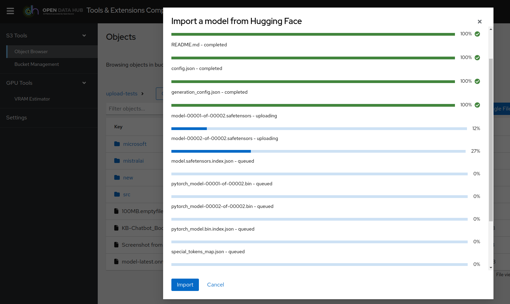
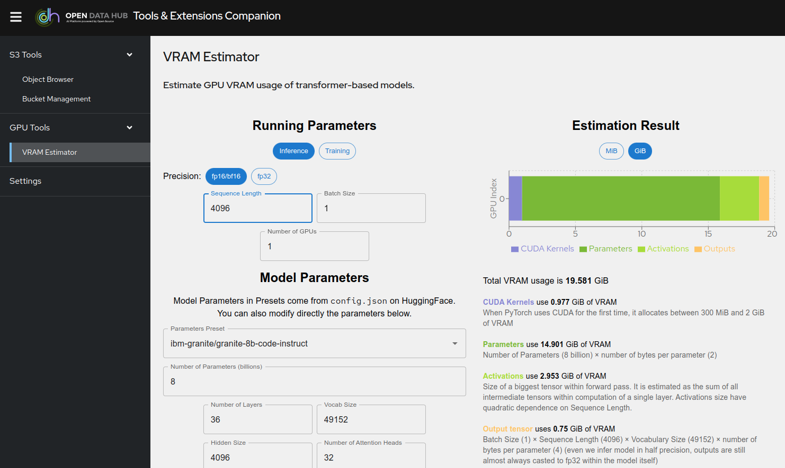

# Open Data Hub Tools &amp; Extensions Companion

This application implements tools that can be useful to anyone working with Open Data Hub (ODH), Red Hat OpenShift AI (RHOAI), or even locally with Podman.

## Current Features

### S3 Tools

- S3 Buckets Management: browsing, creation, deletion
- S3 Objects Browser:
  - Single file upload, Multiple files uploads, Downloads
  - File preview
  - Model import from HuggingFace

### GPU Tools

- VRAM Estimator: helps you calculate the VRAM and number of GPUs you need for inference and training.

### Settings and validations

- S3 connection testing
- HuggingFace authentication testing

## Screenshots

Bucket Management:


Single File Upload to S3:


Multiple File Uploads to S3:


Model Import from HuggingFace:


VRAM Estimator:


## Deployment

A container image of the application is available at: `quay.io/rh-aiservices-bu/odh-tec:latest`

It can be imported as a custom workbench in ODH or RHOAI, used in a standard OpenShift Deployment, or launched locally with Podman (see below).

All the file transfers (computer->backend->S3 or Huggingface->S3) are fully streamed, meaning no local storage is used necessary, and the RAM consumption stays as low as possible (256MB top when importing a 7B model from Hugging face). A setting is available to set the maximum number of concurrent file transfers (default 2). Increasing it will increase memory needs.

### Workbench in ODH or RHOAI

- An admin must Import the custom image.
- Create the Workbench (1 CPU/1GB RAM is more than enough).
- Optionally, attach an existing Data Connection to it.
- Also optionally and create an Environment variable called `HF_TOKEN` to store your Hugging Face token, and another one called `MAX_CONCURRENT_TRANSFERS` set to whatever you want the maximum to be (default without the variable is 2).
- Launch the Workbench.
- If you have not attached a Data Connection or set Environment variables when creating the Workbench, you can always set the parameters through the Settings menu in the application. However, those custom values will be valid only as long as the pod is running.

### Standard Deployment in OpenShift

- Create a standard Deployment of the image, with the associated Service and Route.
- Add the Environment variables you need, following the example in the [env file](./backend/.env.example)
- If you have not set Environment variables when creating the Deployment, you can always set the parameters through the Settings menu in the application. However, those custom values will be valid only as long as the pod is running.

### Local usage with Podman

- Create a `.env` file following [the example](./backend/.env.example).
- Launch the application with:

  ```bash
  podman run --rm -it -p 8888:8888 --env-file=.env quay.io/rh-aiservices-bu/odh-tec:latest
  ```

- Open your browser at http://127.0.0.1:8888
- If you don't create the environment file, you can always set the parameters through the Settings menu in the application. However, those custom values will be valid only as long as the pod is running.

### Configuration

- Connection to S3 information can be set as environment variables. When used as a workbench in ODH or RHOAI, you can simply attach a Data Connection to it, and the values will automatically picked up.
- If you don't attach a data connection or you are using the container in simple Deployment or locally, you can set the environment variables available [here](./backend/.env.example).
- In the above file, you will also find how to set you HuggingFace Token, as well as a parameter to control the maximum number of parallel file uploads or transfers.
- At anytime, you can modify those values in the **Settings** menu of the application. The new values are only valid for the time the container is running. No modifications are made to the original Data Connection or the Environment variables you set at startup.

## Development

- Requirements: NodeJS 18 minimum.
- From the root folder of the repo, run `npm install` to install all the required packages both for the frontend and the backend.
- In both `backend` and `frontend` folders, copy the `.env.example` files to `.env` and adjust the values in the `backend` one to your liking.
- Launch the application in development mode with `npm run dev`.
